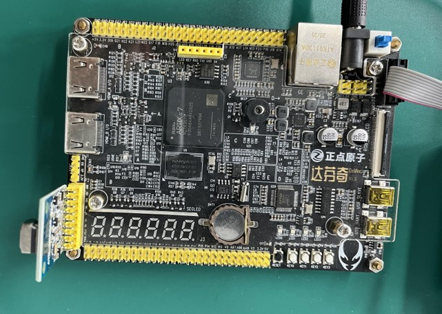
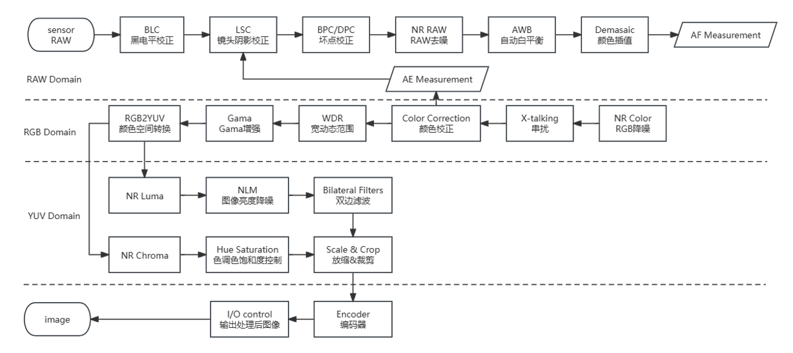
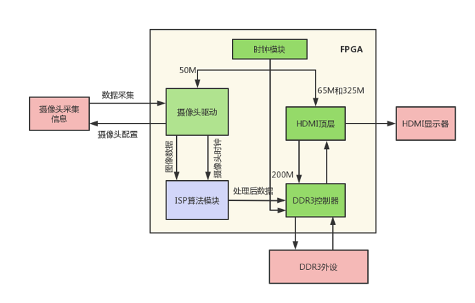
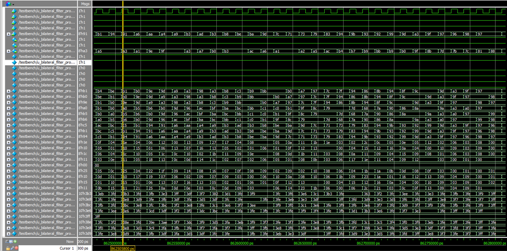

# FPGA_BLIF
Verilog implements bilateral filtering algorithm

## 目录

- [项目简介](#项目简介)
- [项目框架](#项目框架)
- [演示](#演示)
- [许可证](#许可证)
- [联系方式](#联系方式)

## 项目简介

此项目为实习项目中关于ISP算法实现的一部分，目前开源了关于双边滤波部分的实现代码。

这是一个纯'verilog'代码实现。

仓库中的代码包括了图像采集到处理输出的全流程，后续算法可在此工程的的基础上进行扩展。

工程验证使用的开发平台是正点原子的Artix-7达芬奇开发板，使用的摄像头是ov5640。

ISP算法流程有很多，在不同的域中有不同的算法实现。目前常见的基本在RAW域、RGB域、YUV域三个域中进行处理。

## 项目框架

此项目框架包括相机采集模块，该模块通过配置摄像头的不同寄存器的参数信息进行相机采集驱动；将采集到的图像数据在进行缓存与时钟域变换之后送入ISP算法实现模块；经过ISP算法处理之后通过DDR3控制器控制DDR3外缓进行缓存，同时也将处理好的图像连同控制信号送入HDMI显示模块，最终可在HDMI显示器上进行显示。

## 演示

以下是modelsim仿真实现：

## 许可证

本项目使用 [MIT 许可证](https://opensource.org/licenses/MIT) 进行许可。这意味着您可以自由使用、复制、修改和分发本项目的代码，但需在代码的所有副本或主要部分中保留原始版权声明和许可声明。

详细的许可证内容请参见项目中的 [LICENSE](./LICENSE) 文件。

## 联系方式

如有任何问题或建议，欢迎与我们联系：

- **作者**: Saber King
- **GitHub**: [SaberKing29](https://github.com/SaberKing29)
- **电子邮件**: saberking@2292359169@qq.com

您也可以通过在 GitHub 上提交 [Issues](https://github.com/SaberKing29/FPGA_BLIF/issues) 来报告问题或提出功能请求。
